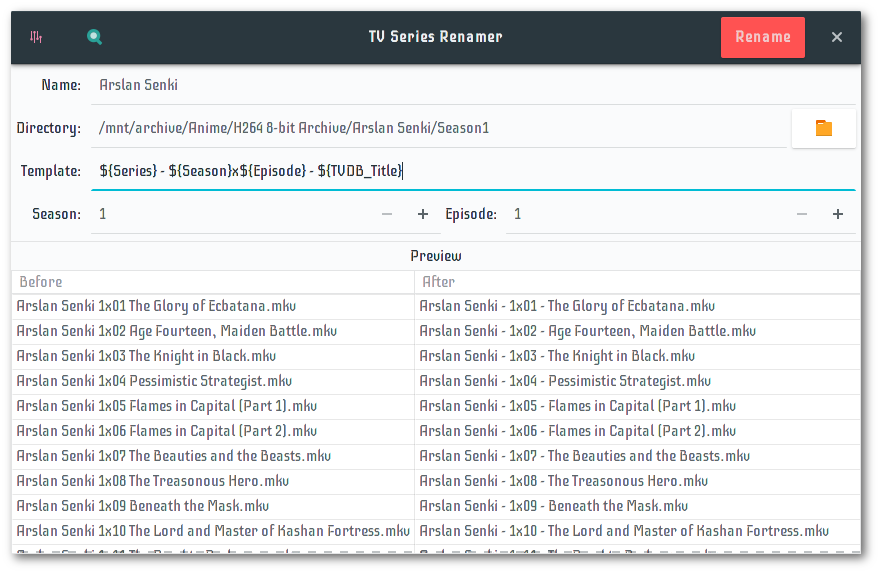

# Installation Instructions

With Rust installed, simply execute `cargo install --git https://github.com/mmstick/tv-renamer` to install with just CLI support. To enable the GTK3 front-end which may be called with the `--gui` flag, simply enable the `enable_gtk` feature with `cargo install --git https://github.com/mmstick/tv-renamer --features "enable_gtk"`.

# GTK3 Manual



The use of this application should be fairly straightforward. Make sure that the only files located in directories to be renamed are files that you want to be renamed as episodes in the series, and ensure that all of the episodes are in alphabetical order. The application does not derive the episode number from the episode name, but by their alphabetical order in the directory.

**Season Name** is where you will place the name of the series that you are renaming, **Season Directory** is the directory where the series is located, **Season Number** is the season number that you have chosen to rename, and **Episode Number** is the episode index by which the renaming application will start counting up from.

The top left `gtk::ListBox` contains `gtk::CheckButton`s for each of the important parameters found in the CLI application. The **Automatic** check button only requires that you fill out the information for the **Season Directory** and **Episode Count** inputs, and will automatically infer the name of the series and season number from the directory structure. Only directories that contain "season" or "special" in the name will be considered by the application, so you are free to have other directories.

The directory structure for **Automatic** should be as follows:

- Series directory

  - Specials OR Season 0

    - Episodes...

  - Season 1

    - Episodes...

  - Season 2

    - Episodes...

The **TVDB Titles** option should be a favorite option for many, as it will also search TVDB for the titles of each episode and append the title in the filenames. **No Series Name** can also be used, which will not prepend the name of the series to each episode. **Log Changes** will simply log changes that have been performed on the disk.

# CLI Manual

If you need help with the usage of the CLI application, this manual page is also included in the program and is invokable with the -h and --help flags.


## NAME:

**tv-renamer** - rename TV series and movies

## DESCRIPTION:

Renames all videos in a directory according to their season number and episode count. Please ensure that all of the files in the directory are files that you want renamed. It is recommended to use the dry-run option first before committing any changes.

If no DIRECTORY is given, the default path will be the current working directory. If a target file already exists, the command will skip the file.

## OPTIONS:

**-a, --automatic**: Automatically infer the season name and number based on the directory structure.

**-d, --dry-run:** Runs through all of the files and prints what would happen without doing anything.

**-l, --log-changes:** Log changes made to the disk to a file in your home directory.

**-n, --series-name:** Sets the name of the series to be renamed. [not optional]

**--no-name:** Disables writing the name of the series when renaming.

**-s, --season-number:** Sets the season number to use when renaming a file. [default: 1]

**-t, --tvdb:** Append the episode title from TVDB to each episode.

**-e, --episode-start:** Sets the episode number to start counting from. [default: 1]

**-p, --pad-length:** Sets the number of digits to pad the episode count for. [default: 2]

**-v, --verbose:** Print the changes that are occurring.

## EXAMPLE:

When executed inside of a directory with the name of the TV Series

```
one.mkv two.mkv three.mkv
> tv-renamer -n "$series"
"TV Series 1x01.mkv"
"TV Series 1x02.mkv"
"TV Series 1x03.mkv"
```

If you do not want to have the series name added to the episodes:

```
> one.mkv two.mkv three.mkv
> tv-renamer --no-name
> "1x01.mkv" "1x02.mkv" "1x03.mkv
```

The season name can also be automatically inferred:

```
"$series/Season1" "$series/Season2"
> tv-renamer "$series" -a OR cd $series && tv-renamer -a
"TV Series/Season1/TV Series 1x01.mkv"
...
"TV Series/Season2/TV Series 2x01.mkv"
...
```

Episode titles can also be pulled from the TVDB and added to the filenames.

```
> tv-renamer -a -t
"TV Series/Season1/TV Series 1x01 Episode Title.mkv"
```

## AUTHOR:

Written by Michael Aaron Murphy.
